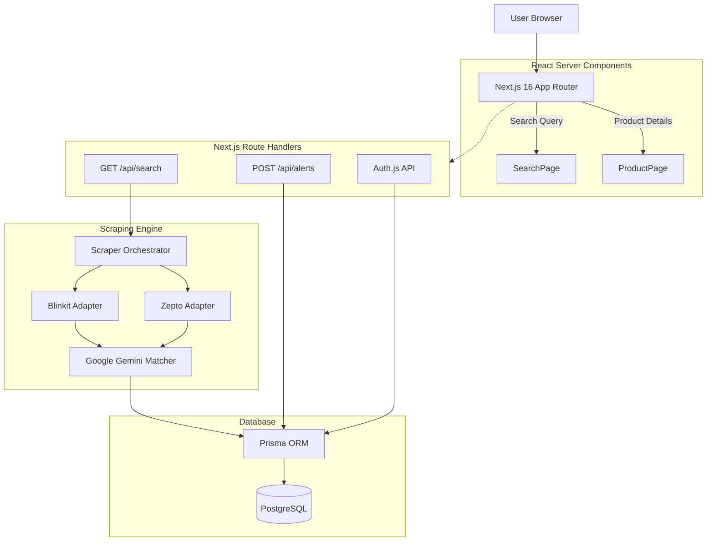

# System Architecture

QuickCompare employs a modern, serverless-oriented architecture designed to handle intensive parallel scraping, AI-based heuristics, and real-time frontend delivery.

## 1. High-Level Overview

## 2. Component Details

### The Scraper Pipeline
The Scraper Orchestrator (`src/scraper/core/Orchestrator.ts`) is responsible for managing the lifecycle of data ingestion.
1. Receives search query.
2. Checks DB Cache (TTL validation).
3. If stale, dispatches parallel execution to platform adapters (Blinkit, Zepto).
4. Adapters run headless HTTP/Puppeteer calls to source systems, normalizing data to an internal schema.

### Product Matching Engine
Because platforms use varying nomenclatures for identical products, QuickCompare uses a two-tier matching system (`src/scraper/core/matcher.ts`):
1. **Fuzzy String/Rule Matching**: Standard string sanitization and volume extraction.
2. **LLM Fallback (Gemini)**: Complex comparisons are delegated to Google's Gemini API which returns structured JSON determining if `Product A` is identical to `Product B`.

### Database Design
The schema uses standard normalization optimized for read-heavy operations:
- `Product`: Central entity storing canonical metadata.
- `Listing`: Platform-specific entries (Blinkit vs Zepto URL, current stock, current price).
- `PriceHistory`: Immutable ledger of price snapshots used to render historical charts.
- `PriceAlert`: User subscriptions mapped to a `Product`.
- `User/Account/Session`: NextAuth standardized schema.

### Authentication & Alert Engine
- **Auth**: Handled by Auth.js via Google OAuth. Sessions are securely managed via HttpOnly cookies.
- **Alerts**: Alerts are bound to `contactAddress` and optionally a `userId`. Background workers poll `PriceHistory` updates and trigger notifications (Notification providers are stubbed for V2).
